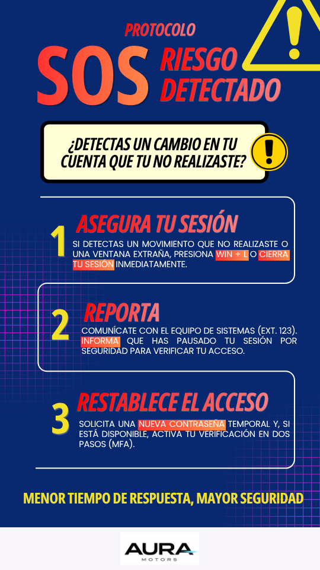

# Human Risk Assessment and Mitigation Road Map 📊

**Entorno:** Aura Motors

**Frameworks:** NIST CSF (ID.RA) | ISO/IEC 27001:2022 (Cláusula 6.1.2)

---

## Introducción y Contexto

Tras el despliegue de la campaña de Awareness [**Security-Awareness-Strategy-AuraMotors**](https://github.com/Andrea-Lira/Security-Awareness-Strategy-AuraMotors), se identificó la necesidad de realizar un análisis profundo de las vulnerabilidades operativas vinculadas al comportamiento humano. Este proyecto documenta el diagnóstico, la priorización y la estrategia de remediación para los vectores de riesgo más críticos de la operación diaria de **Aura Motors**

## Alcance

Este análisis cubre a los 50 colaboradores de los diversos departamentos de la agencia, divididos en tres áreas críticas:

 1. **Ventas de piso y campo:** Alta movilidad y manejo de datos personales de los clientes.
 2. **Administración y finanzas:** Manejo de datos bancarios, facturación, transferencias y nóminas.
 3. **Servicio Técnico/Taller:** Acceso a sistémas de diagnóstico y bases de datos de refacciones.

## Metodología de Evaluación

Para este diagnóstico se utilizó la metodología de **Análisis de Riesgo Cualitativo** basada en:

  * **Probabilidad (1-5):** Frecuencia estimada de ocurrencia del evento.
  * **Impacto (1-5):** Severidad de daño (financiero, reputacional o legal).
  * **Nivel de Riesgo:** Probabilidad x impacto = Nivel de riesgo.

---

| Riesgo Identificado | Probabilidad | Impacto | Nivel de Riesgo | Justificación del Impacto (Negocio) |
| :--- | :---: | :---: | :---: | :--- |
| **1. Cuentas Compartidas (Ventas)** | 5 | 4 | **20 (Crítico)** | Imposibilidad de auditoría en caso de fraude o fuga de datos de clientes (RGPD/LFPDPPP). |
| **2. Conexiones Wi-Fi Públicas (BYOD)** | 4 | 3 | **12 (Alto)** | Exposición de credenciales corporativas y riesgo de interceptación de tráfico (Man-in-the-Middle). |
| **3. Vishing (Ingeniería Social)** | 2 | 5 | **10 (Medio)** | Alto impacto financiero si se concede acceso remoto a sistemas de pago o inventario. |

---

### Análisis de Resultados

* **El riesgo más crítico (20)** es el uso de cuentas compartidas. Al ser una agencia de ventas, la falta de **No Repudio** (saber quién hizo qué) representa una vulnerabilidad legal y operativa inaceptable.
* **El Vishing**, aunque tiene una probabilidad menor debido a la desconfianza natural del personal, mantiene un **Impacto 5** ya que un solo ataque exitoso podría comprometer la red completa.

## Estructura de Documentación (Sprints de Trabajo)

A continuación se muestran los 3 pilares de este proyecto

1. **Matriz de Riesgos Identificados**
   Documentación técnica de los 3 vectores críticos (Identidad, Movilidad e Ingeniería Social).
   
2. **Protocolo de Respuesta Rápida (Entregable Visual)**
   Diseño instruccional de la Guía "SOS" para fomentar la cultura del reporte inmediato.

   

El diseño de la **Guía SOS** prioriza la legibilidad bajo estrés (reducción de carga cognitiva). Se implementaron resaltadores visuales en las acciones críticas para minimizar el **Mean Time to Respond (MTTR)**, alineándose con el dominio de **Response (RS)** del framework **NIST CSF**.

3. **Roadmap de Remediación (Estrategia 90 días)**
   Plan de acción para la implementación de controles técnicos y administrativos. (EN PROCESO)

## Marco Normativo

Este análisis de riesgo cumple los requerimientos de:

  * **NIST CSF (Identify-Risk Assessment):** Identificación de amenazas y vulnerabilidades.
  * **ISO 27001 (6.1.2):** Proceso de evaluación de riesgos de seguridad de la información.

